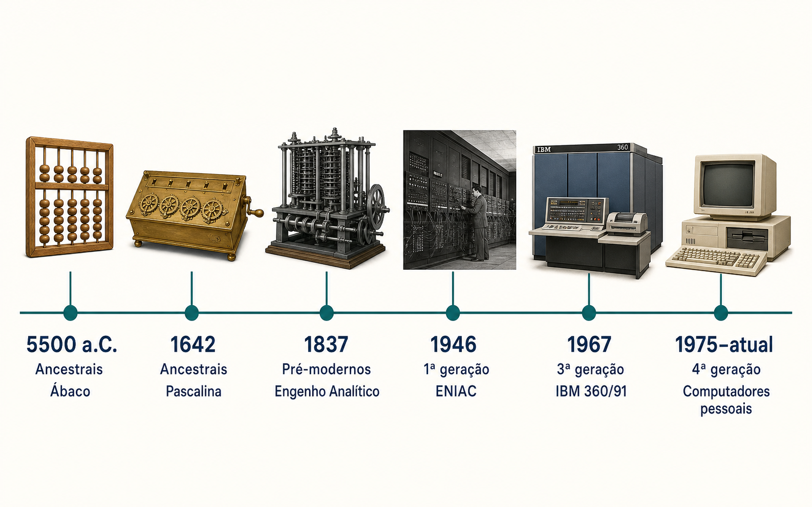
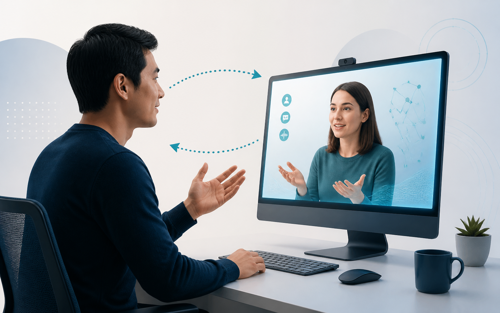
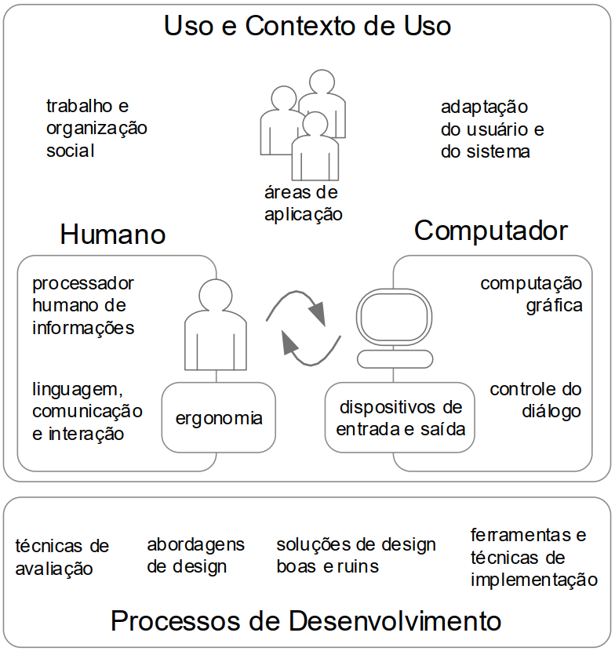

---
layout: image
side: right
image: ../../assets/ihc-ux-book-cover.png
kicker: Livro-texto
title: Interação Humano-Computador e Experiência do Usuário
class: book-slide
---

Uma introdução acessível aos conceitos, métodos e práticas de IHC e UX.

<!--
[Sources]
- https://d2sofvawe08yqg.cloudfront.net/ihc-ux/s_hero2x?1620664410&1620664410
-->

---
layout: define
kicker: Definição
term: Sistemas Computacionais Interativos (SCIs)
definition: Sistemas compostos por hardware, software e meios de comunicação, desenvolvidos para interagir com pessoas.
---

---
layout: image
side: right
image: ../../assets/trabalho-antes-dos-scis.png
kicker: Antes dos SCIs
title: Como era a sociedade antes dos SCIs?
---

O trabalho dependia de processos físicos, registros em papel e circulação manual da informação.

<!--
[Sources]
- Imagem gerada com OpenAI ImageGen para esta aula.
-->

---
layout: image
side: right
image: ../../assets/trabalho-com-scis.png
kicker: Com os SCIs
title: Como é a sociedade com os SCIs?
class: scis-slide
---

O trabalho passa a combinar pessoas, informação e sistemas em uma mesma atividade.

<!--
[Sources]
- Imagem gerada com OpenAI ImageGen para esta aula.
-->

---
layout: default
class: visual-slide visual-slide--concept
---

<!--
[Sources]
- https://www.slideshare.net/slideshow/evoluo-da-informtica-24946304/24946304
- Imagem gerada com OpenAI ImageGen a partir dos marcos da fonte acima.
-->

---
layout: statement
kicker: Comportamento
title: Os SCIs mudaram o nosso comportamento?
---

---
layout: statement
kicker: Intuição
title: Interagir com “máquinas” é intuitivo?
---

---
layout: statement
kicker: Ideal
title: Como seria a interação ideal com máquinas?
---

---
layout: default
class: visual-slide visual-slide--concept
---

<!--
[Sources]
- Imagem gerada com OpenAI ImageGen para esta aula.
-->

---
layout: default
class: visual-slide visual-slide--concept
---

<!--
[Sources]
- Figura fornecida pelo professor em IHC-latex-2025.2/Modules/MD1/Figures/objetos_estudo.png.
-->

---
layout: feature
kicker: Encerramento
title: Obrigado!
columns: 2
features:

- { icon: "lucide:globe", desc: filipefernandesphd.com }
- { icon: "lucide:instagram", desc: "@filipfernandesphd" }

---

---
layout: two-cols
title: Avaliação da Experiência de Aprendizagem
---
- **[Seu feedback é muito importante!](https://forms.gle/CMfL5oTm235FfuH59)**
- Obtenha o código da avaliação
::right::

