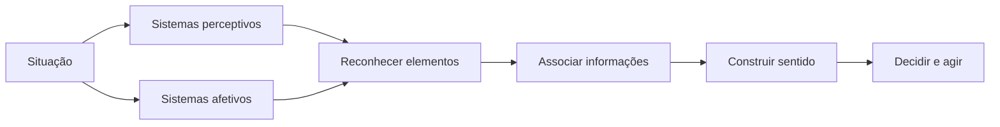

---
layout: section
title: Teoria
index: "T"
---

---
layout: define
kicker: Conceito central
term: Cognição
definition: Conjunto de processos mentais responsáveis por perceber, compreender e orientar as tomadas de decisão humanas.
points:
  - Percepção e atenção
  - Memória e aprendizagem
  - Raciocínio e decisão
---

---
layout: diagram
kicker: Funcionamento
title: Como o sistema cognitivo constrói sentido
highlight: [Situacao, Sentido, Decisao]
note: Percepção e emoção alimentam o reconhecimento; as associações dão significado à situação.
---

---
layout: statement
kicker: O que isso tem a ver com IHC?
title: Compreender a cognição ajuda a projetar interações compatíveis com as capacidades humanas.
---

---
layout: vs
kicker: Tipos de sistemas cognitivos
title: Duas formas complementares de pensar
label: e
left:
  title: Sistema 1 · Intuição
  items: [Rápido, Automático, Baixo esforço]
right:
  title: Sistema 2 · Reflexão
  items: [Lento, Deliberado, Alto esforço]
---

<Cite bref="kahneman2011thinking" />

---
layout: section
title: Sistema 1
kicker: Tipo de Sistema Cognitivo
index: "1"
---

---
layout: feature
kicker: Intuição
title: Sistema 1
columns: 3
features:
  - { icon: "lucide:zap", title: Inconsciente, desc: Operações automáticas }
  - { icon: "lucide:gauge", title: Imediato, desc: Respostas rápidas }
  - { icon: "lucide:feather", title: Baixo esforço, desc: Pouca carga cognitiva }
---

---
layout: default
kicker: Exemplos
title: O Sistema 1 em ação
---

<v-clicks>

- Reconhecimento automático de ícones e botões familiares
- Reação rápida a alertas visuais
- Resposta imediata a sons de notificação

</v-clicks>

---
layout: statement
kicker: Onde aplicar?
title: Em tarefas rotineiras, simplifique comandos e ofereça feedback claro e imediato.
---

---
layout: logos
kicker: Exemplos familiares
title: Reconhecemos antes mesmo de ler
columns: 4
logos:
  - { icon: "lucide:trash-2" }
  - { icon: "lucide:search" }
  - { icon: "lucide:triangle-alert" }
  - { icon: "lucide:message-circle" }
---

---
layout: section
title: Sistema 2
kicker: Tipo de Sistema Cognitivo
index: "2"
---

---
layout: feature
kicker: Reflexão
title: Sistema 2
columns: 3
features:
  - { icon: "lucide:brain", title: Consciente, desc: Operações deliberadas }
  - { icon: "lucide:list-checks", title: Planejado, desc: Etapas e raciocínio }
  - { icon: "lucide:focus", title: Exigente, desc: Atenção e esforço }
---

---
layout: default
kicker: Exemplos
title: O Sistema 2 em ação
---

<v-clicks>

- Preenchimento de formulários complexos
- Uso de ferramentas de análise de dados
- Tomada de decisões críticas em sistemas

</v-clicks>

---
layout: statement
kicker: Onde aplicar?
title: Em tarefas complexas, forneça guias e instruções que sustentem atenção e foco.
---

---
layout: default
kicker: Exemplo
title: Análise de dados exige reflexão
---

<Figure
  src="../../assets/jira-analise-dados.png"
  alt="Painel do Jira com gráficos e indicadores para análise de dados"
  caption="Ferramentas complexas devem revelar estrutura, estado e próximos passos."
/>

<!--
[Sources]
- https://www.opservices.com.br/wp-content/uploads/2022/06/Jira-1024x653.png
-->

---
layout: section
title: Implicações para IHC
index: "I"
---

---
layout: statement
kicker: Projetar para a cognição
title: Dois fenômenos ajudam a transformar capacidades cognitivas em decisões de interface.
---

---
layout: section
title: 1º fenômeno
kicker: Reconhecimento
index: "1"
---

---
layout: define
kicker: 1º fenômeno
term: Reconhecimento
definition: Identificar a função dos elementos da interface a partir de sua aparência e de padrões já aprendidos.
points:
  - Botões
  - Campos de texto
  - Controles de seleção
---

---
layout: default
kicker: Exemplo 1
title: O formato comunica possibilidades
---

<Figure
  src="../../assets/1fenomeno-exemplo.png"
  alt="Comparação visual entre estilos de botões de interface"
/>

---
layout: default
kicker: Exemplo 2
title: Consistência dentro de uma família de produtos
---

<Figure
  src="../../assets/apple-product.png"
  alt="Exemplo de padrões visuais recorrentes em produtos Apple"
/>

---
layout: default
kicker: Exemplo 3
title: Padrões visuais transferem aprendizado
---

<Figure
  src="../../assets/google-product.png"
  alt="Exemplo de padrões visuais recorrentes em produtos Google"
/>

---
layout: default
kicker: Exemplo 4
title: O seu produto também precisa ser reconhecível
---

<Figure
  src="../../assets/your-product.png"
  alt="Interface hipotética que combina convenções visuais de diferentes produtos"
/>

---
layout: section
title: 2º fenômeno
kicker: Interpretação
index: "2"
---

---
layout: define
kicker: 2º fenômeno
term: Interpretação
definition: Atribuir significado ao elemento percebido e antecipar o resultado de uma ação.
points:
  - O que este controle significa?
  - O que acontecerá se eu acioná-lo?
---

---
layout: default
kicker: Exemplo 1
title: Rótulos orientam interpretações diferentes
---

<Figure
  src="../../assets/submit-bottons.png"
  alt="Botões de envio com rótulos que induzem interpretações distintas"
  caption="A forma pode ser semelhante; o significado percebido depende do rótulo e do contexto."
/>

---
layout: section
title: Hands-on
index: "H"
---

---
layout: steps
kicker: Desafio prático
title: Projete uma interface funcional
steps:
  - { title: Escolha, desc: Defina uma tarefa e seus usuários, icon: "lucide:target" }
  - { title: Aplique, desc: Combine Sistemas 1 e 2 com os dois fenômenos, icon: "lucide:brain-circuit" }
  - { title: Implemente, desc: Use IA na codificação se desejar, icon: "lucide:code-2" }
  - { title: Execute, desc: Recomenda-se um projeto Node.js, icon: "lucide:play" }
---

---
layout: default
title: Referências
---

<BiblioList />

---
layout: feature
kicker: Encerramento
title: Obrigado!
columns: 2
features:

- { icon: "lucide:globe", desc: filipefernandesphd.com }
- { icon: "lucide:instagram", desc: "@filipfernandesphd" }

---

---
layout: two-cols
title: Avaliação da Experiência de Aprendizagem
---

- **[Seu feedback é muito importante!](https://forms.gle/CMfL5oTm235FfuH59)**
- Obtenha o código da avaliação

::right::

