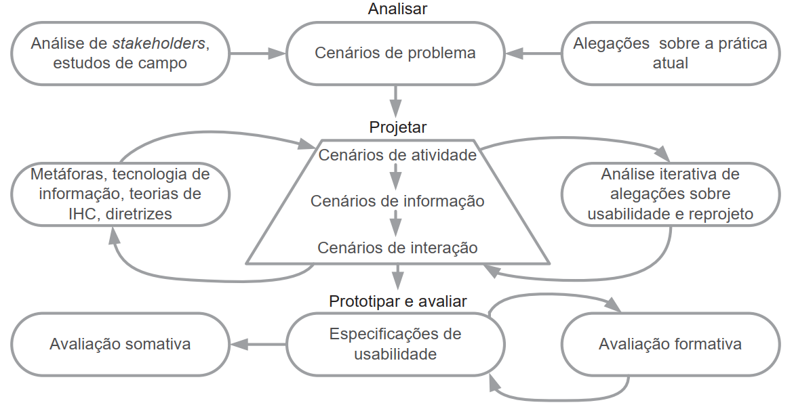

---
layout: section
index: "T"
title: Teoria
---
---
layout: section
title: Design Baseado em Cenários
subtitle: Histórias de uso para compreender, projetar e avaliar interações
---
---
layout: statement
kicker: Conceito central
title: Cenário é uma história sobre pessoas executando uma atividade
---
---
layout: reference
kicker: Cenário
title: Características
items:
  - { term: Contexto, desc: Detalhes da situação em que a interação acontece }
  - { term: Atores, desc: Pessoas interagindo com o SCI }
  - { term: Objetivos, desc: Motivações que orientam as ações }
  - { term: Planejamento, desc: Transformação de um objetivo em comportamento }
  - { term: Ações, desc: Comportamentos observáveis durante a interação }
  - { term: Eventos, desc: Reações produzidas pelo SCI }
  - { term: Avaliação, desc: Interpretação da situação pelos atores }
---

---
layout: section
title: Exemplo
index: "Cenário"
---

---
layout: default
title: Confirmação do cadastro de projetos finais
kicker: Exemplo de Cenário
---
**Atores**: Marcos Correa (professor)

**Cenário**: 

Marcos Correa, orientador de Fernando, é um professor requisitado que orienta diversos alunos ao mesmo tempo.

---
title: Confirmação do cadastro de projetos finais
kicker: Exemplo de Cenário (cont.)
---
Todo início de período ele recebe diversas mensagens informando-lhe sobre os projetos finais cadastrados sob sua supervisão. 

---
title: Confirmação do cadastro de projetos finais
kicker: Exemplo de Cenário (cont.)
---
Infelizmente, as mensagens não apresentam os dados cadastrados, então ele precisa entrar no sistema para conferir os dados.

---
title: Confirmação do cadastro de projetos finais
kicker: Exemplo de Cenário (cont.)
---
Além disso, mesmo já estando no sistema e verificando um projeto, ele não consegue ver os dados dos outros projetos pendentes.

---
title: Confirmação do cadastro de projetos finais
kicker: Exemplo de Cenário (cont.)
---
Sendo assim, tem de ficar alternando entre o seu cliente de e-mail e o sistema acadêmico, e às vezes ele acaba visitando os dados de um mesmo projeto mais de uma vez

---
layout: agenda
kicker: Design Baseado em Cenários
title: Atividades
items:
  - { topic: Análise, desc: compreender atores, contexto, objetivos e problemas }
  - { topic: Projeto, desc: propor alternativas de solução guiadas pelos cenários }
  - { topic: Prototipação, desc: materializar a solução para discutir e testar }
  - { topic: Avaliação, desc: verificar se a solução apoia melhor a atividade }
---
---
layout: diagram
kicker: Design Baseado em Cenários
title: Ciclo das atividades
---

<!-- A imagem indicada no prompt estava em um caminho local do computador do usuário. O deck referencia o arquivo esperado dentro de public/assets. -->
---
layout: section
index: "H"
title: Hands-On
---
---
layout: default
title: Na prática
---

- Você desenvolverá uma solução totalmente nova
- Crie **3 cenários** para esta solução
- Cada cenário deve envolver pessoas, objetivos, contexto, ações e avaliação da situação

<Callout icon="lucide:pencil-ruler" tone="accent">
Aproveite esta etapa para desenvolver uma parte do trabalho.
</Callout>

<!-- Oriente os alunos a escreverem cenários antes de desenhar telas: primeiro a atividade, depois a interface. -->

---
layout: feature
kicker: Encerramento
title: Obrigado!
columns: 2
features:

- { icon: "lucide:globe", desc: filipefernandesphd.com }
- { icon: "lucide:instagram", desc: "@filipfernandesphd" }

---

---
layout: two-cols
title: Avaliação da Experiência de Aprendizagem
---

- **[Seu feedback é muito importante!](https://forms.gle/CMfL5oTm235FfuH59)**
- Obtenha o código da avaliação

::right::

